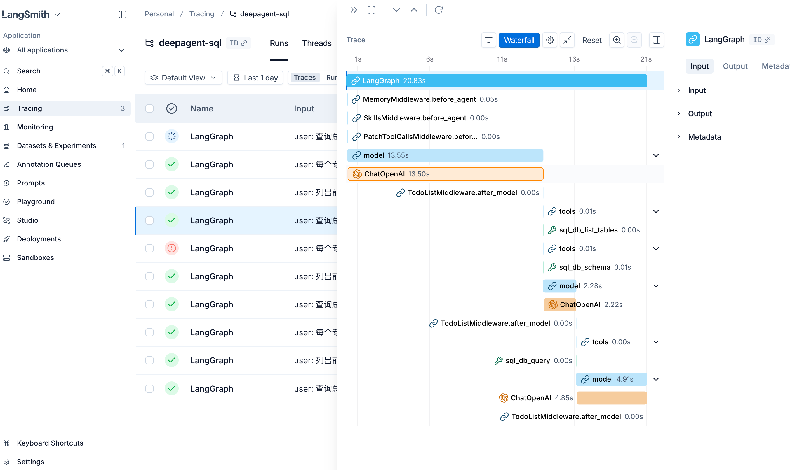

# Harness Engineer - 自然语言 SQL 查询助手

基于 **DeepAgent** 框架的智能 SQL 查询助手，专为 Harness Engineer 设计。

## 功能特性

- 🤖 **自然语言查询**：用中文提问，自动生成 SQL 查询
- 🔍 **Schema 探索**：自动发现和理解数据库结构
- 📊 **可视化图表**：支持生成 LangGraph 工作流程图
- 📝 **LangSmith 追踪**：完整的执行日志和调试信息
- 🔒 **安全查询**：只读模式，仅允许 SELECT 操作
- 🎯 **DeepAgent 驱动**：基于 DeepAgents 框架，支持技能和记忆模块

## 项目简介

这是一个为 **Harness Engineer** 打造的智能 SQL 查询助手，基于 **DeepAgent** 框架构建。

**核心价值：**
- ⚡ **零 SQL 基础**：无需学习 SQL 语法，直接用自然语言提问
- 🎯 **精准查询**：自动理解业务意图，生成准确的 SQL 查询
- 🔧 **工具集成**：内置 SQL 查询、Schema 检查、查询验证等工具
- 📈 **可观测性**：通过 LangSmith 完整追踪每次查询的执行过程

**适用场景**：
- 数据分析师快速查询业务数据
- 工程师排查数据库问题
- 产品经理查看业务指标
- 运营人员获取统计数据

### 1. 安装依赖

```bash
pip3 install -r requirements.txt
```

### 2. 配置环境变量

复制 `.env.example` 创建 `.env` 文件：

```bash
cp .env.example .env
```

编辑 `.env` 文件，填入你的 API 密钥：

```env
# 阿里云百炼 API Configuration
OPENAI_API_KEY=sk-your_api_key_here
OPENAI_API_BASE=https://dashscope.aliyuncs.com/compatible-mode/v1

# LangSmith Configuration
LANGCHAIN_TRACING_V2=true
LANGCHAIN_API_KEY=lsv2_your_api_key_here
LANGCHAIN_PROJECT=deepagent-sql
```

### 3. 初始化数据库（可选）

如果需要测试数据：

```bash
python3 init_db.py
```

### 4. 运行 Agent

```bash
python3 agent.py
```

### 5. 生成 LangGraph 可视化图

```bash
# 生成默认图表
python3 agent.py --draw-graph

# 自定义输出文件名
python3 agent.py --draw-graph --output my_graph.png
```

## 使用示例

在代码中调用：

```python
from agent import create_sql_deep_agent, execute_query

# 创建 agent
agent = create_sql_deep_agent()

# 执行自然语言查询
result = execute_query(agent, "查询总共有多少首歌曲？")
print(result)

result = execute_query(agent, "列出前 5 位艺术家的名字")
print(result)

result = execute_query(agent, "每个专辑有多少首歌曲？")
print(result)
```

## 数据库结构

示例数据库包含以下表：

- **Artists** - 艺术家信息
- **Albums** - 专辑信息
- **songs** - 歌曲信息
- **MediaType** - 媒体类型
- **Genres** - 音乐流派

## 工具说明

Agent 提供以下 SQL 工具：

1. **sql_db_query** - 执行 SQL 查询
2. **sql_db_schema** - 查看表结构
3. **sql_db_list_tables** - 列出所有表
4. **sql_db_query_checker** - 检查 SQL 正确性

## 注意事项

- ⚠️ **只读访问**：只能执行 SELECT 查询，不能修改数据
- ⚠️ **API 密钥**：需要阿里云百炼 API Key 才能运行
- ⚠️ **Python 版本**：需要 Python 3.8+
- ⚠️ **macOS 用户**：使用 `python3` 命令而非 `python`

## 获取 API Key

### 阿里云百炼
1. 访问 [阿里云百炼控制台](https://dashscope.console.aliyun.com/)
2. 注册/登录阿里云账号
3. 开通百炼服务
4. 创建 API Key

### LangSmith（可选）
1. 访问 [LangSmith](https://smith.langchain.com/)
2. 注册账号
3. 在 Settings → API Keys 创建密钥

## LangSmith Trace 追踪

### 配置

在 `.env` 文件中配置 LangSmith：

```env
# LangSmith Configuration
LANGCHAIN_TRACING_V2=true
LANGCHAIN_API_KEY=lsv2_your_api_key_here
LANGCHAIN_PROJECT=deepagent-sql
```

### 查看 Trace



从上图可以看到完整的查询执行链路：

**执行流程说明**：

1. **LangGraph **(总耗时 20.83s)
   - 整个查询的总执行时间

2. **MemoryMiddleware.before_agent **(0.05s)
   - 加载记忆模块，从 AGENTS.md 读取指令

3. **SkillsMiddleware.before_agent **(0.00s)
   - 加载技能模块（query-writing、schema-exploration）

4. **Model 推理 **(13.55s)
   - ChatOpenAI (Qwen-Max) 进行语义理解和 SQL 生成
   - 这是最耗时的步骤，占用了大部分时间

5. **工具调用 **(0.01s)
   - `sql_db_list_tables` - 列出所有表（0.00s）
   - `sql_db_schema` - 查看表结构（0.01s）

6. **SQL 查询执行**
   - `sql_db_query` - 执行生成的 SQL 查询（0.00s）
   - 返回最终结果

### 如何使用 LangSmith？

1. **访问控制台**
   - 打开 https://smith.langchain.com/
   - 登录你的账号

2. **查看项目**
   - 左侧菜单选择 "Tracing"
   - 找到 `deepagent-sql` 项目

3. **分析 Runs**
   - 点击任意一次查询记录
   - 查看瀑布图（Waterfall View）
   - 展开每个步骤查看输入/输出详情

4. **性能优化**
   - 识别耗时最长的步骤
   - 通常 Model 推理占主要时间（13-14s）
   - 工具调用和 SQL 执行非常快（<0.01s）

### 关键指标

- **总耗时**：~20s（包含多次 LLM 调用）
- **首次推理**：~13.5s（理解问题 + 生成 SQL）
- **工具调用**：<0.01s（数据库操作）
- **成功率**：绿色✓表示成功，红色✗表示失败

### 调试技巧

- 🔍 **查看 Input/Output**：点击右侧面板查看每一步的输入输出
- ⏱️ **识别瓶颈**：蓝色条越长表示耗时越多
- 🐛 **错误定位**：红色标记的步骤表示失败
- 📊 **Token 统计**：查看 API 调用成本

## 项目结构

```
deepagent-sql/
├── agent.py              # 主程序
├── init_db.py           # 数据库初始化脚本
├── chinook.db          # SQLite 数据库
├── .env                # 环境变量配置（需自行创建）
├── .env.example        # 环境变量示例
├── requirements.txt    # Python 依赖
├── AGENTS.md          # Agent 指令文件
└── skills/            # 技能模块
    ├── query-writing/
    └── schema-exploration/
```
